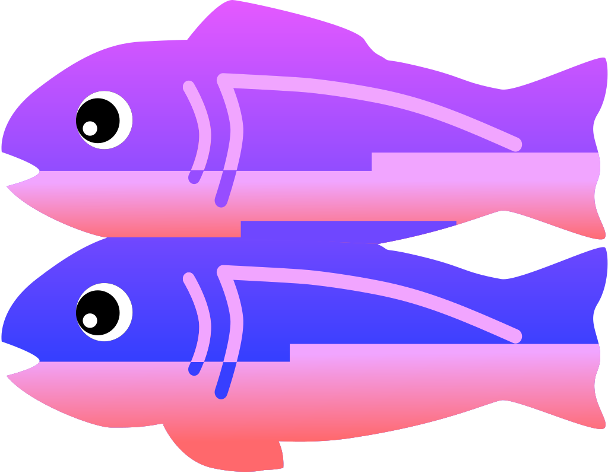

### Hi there 👋
- 💬 Ask me about hacking
- 📫 How to reach me: https://madhanmaaz.netlify.app

### 🔐 Who Am I?
- I'm Madhan, an ethical hacker and cybersecurity enthusiast, committed to making the internet a safer place for all.
With a passion for unraveling the mysteries of cyber threats and vulnerabilities, I'm here to share my insights,
discoveries, and expertise with you.

### Programming Languages
<table style="text-align: center;">
    <tr>
        <td>
            
        </td>
        <td>
            
        </td>
        <td>
            
        </td>
         <td>
            
        </td>
        <td>
            
        </td>
        <td>
            
        </td>
    </tr>
    <tr>
        <th>Javascript</th>
        <th>Python</th>
        <th>Golang</th>
        <th> C++ </th>
        <th>Php</th>
        <th>  C  </th>
    </tr>
</table>

### Front-End Development
<table style="text-align: center;">
    <tr>
        <td>
            
        </td>
        <td>
            
        </td>
        <td>
            
        </td>
        <td>
            
        </td>
        <td>
            
        </td>
    </tr>
    <tr>
        <th>Html</th>
        <th>Css</th>
        <th>Javascript</th>
        <th>Bulma</th>
        <th>React</th>
    </tr>
</table>

### Back-End Development
<table style="text-align: center;">
    <tr>
        <td>
            
        </td>
        <td>
            
        </td>
        <td>
            
        </td>
    </tr>
    <tr>
        <th>ExpressJs</th>
        <th>Flask</th>
        <th>Php</th>
    </tr>
</table>

### Desktop app Developemnt CLI/GUI
<table style="text-align: center;">
    <tr>
        <td>
            
        </td>
        <td>
            
        </td>
        <td>
            
        </td>
        <td>
            
        </td>
    </tr>
    <tr>
        <th>Electronjs</th>
        <th>Python</th>
        <th>Golang</th>
        <th>C++</th>
    </tr>
</table>

### Mobile Development

<table style="text-align: center;">
    <tr>
        <td>
             
        </td>
    </tr>
    <tr>
        <th>React Native</th>
    </tr>
</table>

### Database
<table style="text-align: center;">
    <tr>
        <td>
            
        </td>
        <td>
            
        </td>
        <td>
            
        </td>
    </tr>
    <tr>
        <th>MongoDB</th>
        <th>MySQL</td>
        <th>Firebase</th>
    </tr>
</table>

### Others
<table style="text-align: center;">
    <tr>
        <td>
            
        </td>
        <td>
            
        </td>
         <td>
            
        </td>
        <td>
            
        </td>
        <td>
            
        </td>
    </tr>
    <tr>
        <th>Docker</th>
        <th>Git</th>
        <th>Netlify</th>
        <th>Puppeteer</th>
        <th>Glitch</th>
    </tr>
</table>
